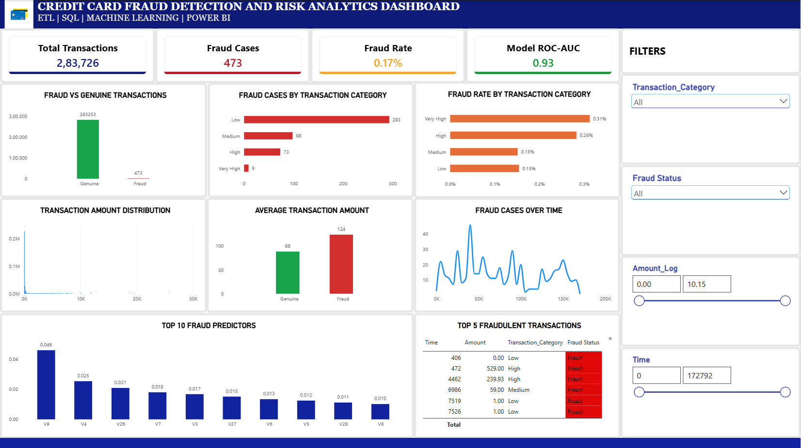

# 💳 Credit Card Fraud Detection & Risk Analytics Dashboard

> **End-to-end fraud analytics project combining Python ETL, SQL, Machine Learning, and Power BI to identify fraud patterns and communicate risk insights through an interactive dashboard.**


---

## 📊 Dashboard Preview

<p align="center">
  
</p>

---

## 🎯 Project Overview

Credit card fraud detection is a highly imbalanced classification problem where fraudulent transactions represent only a small fraction of total transactions.

This project demonstrates an **end-to-end data and risk analytics workflow**:

**Raw Transaction Data → Python ETL → Cleaned Dataset → SQL Analysis → Machine Learning → Model Evaluation → Power BI Risk Dashboard**

It goes beyond simple accuracy by focusing on **precision, recall, F1-score, confusion matrix, and ROC-AUC** — metrics that are far more informative than accuracy for a problem where fraud makes up less than 0.2% of transactions.

---

## 📌 Key Results

| Metric | Result |
|---|---:|
| Total Transactions | **283,726** |
| Fraudulent Transactions | **473** |
| Genuine Transactions | **283,253** |
| Overall Fraud Rate | **0.17%** |
| Model ROC-AUC | **0.93** |

The low fraud rate demonstrates why **accuracy alone is not sufficient** for evaluating a fraud detection model.

---

## 🧩 Business Problem

Financial institutions need to identify potentially fraudulent transactions while minimizing unnecessary disruption to legitimate customers.

This project explores questions such as:

- How many transactions are fraudulent, and what percentage of the total do they represent?
- How does fraud vary across transaction-value categories?
- How does fraud activity change over time?
- Are fraudulent transactions associated with different average transaction amounts?
- Which anonymized features contribute most to model predictions?
- How should a fraud classifier be evaluated when the classes are highly imbalanced?

---

## 🔄 End-to-End Workflow

```text
Raw Transaction Dataset
          │
          ▼
     Python ETL
 Extract → Transform → Load
          │
          ▼
    Cleaned Dataset
   fraud_cleaned.csv
          │
     ┌────┴────┐
     ▼         ▼
   SQL      Machine
 Analysis   Learning
     │         │
     └────┬────┘
          ▼
      Power BI
   Risk Dashboard
```

---

## 🛠️ Technology Stack

**Data Processing & ETL**
- Python, Pandas, NumPy
- Data cleaning and transformation
- Transaction categorization and feature preparation

**Database & Analytics**
- SQL, SQLite
- Fraud-rate and category-level analysis
- Aggregations and analytical queries

**Machine Learning**
- Scikit-learn, Random Forest classification
- Precision, Recall, F1-score
- Confusion Matrix, ROC Curve / ROC-AUC
- Feature importance

**Visualization**
- Microsoft Power BI
- KPI cards, bar charts, line charts
- Interactive slicers and transaction-level tables
- Feature-importance visualization

---

## 📁 Project Structure

```text
Credit-Card-Fraud-Dashboard/
│
├── Analysis/
│   └── eda.py
│
├── Data/
│   ├── creditcard.csv
│   └── processed/
│       └── fraud_cleaned.csv
│
├── ETL/
│   ├── extract.py
│   ├── transform.py
│   └── load.py
│
├── Model/
│   ├── train_model.py
│   ├── evaluate_model.py
│   ├── feature_importance.py
│   └── saved_model.pkl
│
├── Screenshots/
│   └── model/
│       ├── confusion_matrix.png
│       ├── roc_curve.png
│       └── feature_importance.png
│
├── SQL/
│   ├── fraud_analysis.sql
│   └── fraud.db
│
├── PowerBI/
│   └── Credit_Card_Fraud_Dashboard.pbix
│
├── requirements.txt
└── README.md
```

---

## 🚀 How to Run

1. **Clone the repository**
   ```bash
   git clone https://github.com/<your-username>/Credit-Card-Fraud-Dashboard.git
   cd Credit-Card-Fraud-Dashboard
   ```

2. **Install dependencies**
   ```bash
   pip install -r requirements.txt
   ```

3. **Run the ETL pipeline**
   ```bash
   python ETL/extract.py
   python ETL/transform.py
   python ETL/load.py
   ```
   This produces `Data/processed/fraud_cleaned.csv`.

4. **Train and evaluate the model**
   ```bash
   python Model/train_model.py
   python Model/evaluate_model.py
   python Model/feature_importance.py
   ```

5. **Explore the SQL analysis**
   Run the queries in `SQL/fraud_analysis.sql` against `SQL/fraud.db`, or load `fraud_cleaned.csv` into any SQL engine of your choice.

6. **Open the dashboard**
   Open `PowerBI/Credit_Card_Fraud_Dashboard.pbix` in **Power BI Desktop** (Windows). If you don't have Power BI Desktop, refer to the dashboard screenshots in this README and in `Screenshots/model/` for a full walkthrough of the visuals.

---

## ⚙️ 1. Data & ETL Pipeline

The project starts with the raw credit-card transaction dataset.

**Extract** — Loads the raw transaction data into Pandas.

**Transform** — Prepares the dataset for analysis and modeling by:
- Cleaning the transaction data
- Creating `Transaction_Category`
- Creating `Amount_Log`
- Preparing model-ready features
- Preserving the fraud target variable (`Class`)

**Load** — The transformed dataset is saved as `Data/processed/fraud_cleaned.csv`, which is reused for SQL analysis and Power BI reporting.

---

## 🗄️ 2. SQL Fraud Analysis

SQL was used to demonstrate database-oriented fraud analytics.

**Fraud count**
```sql
SELECT
    SUM(Class) AS Fraud_Count
FROM fraud_cleaned;
```

**Fraud rate**
```sql
SELECT
    ROUND(
        100.0 * SUM(Class) / COUNT(*),
        2
    ) AS Fraud_Rate
FROM fraud_cleaned;
```

**Fraud cases by transaction category**
```sql
SELECT
    Transaction_Category,
    SUM(Class) AS Fraud_Count
FROM fraud_cleaned
GROUP BY Transaction_Category
ORDER BY Fraud_Count DESC;
```

SQL provides the analytical foundation for the risk metrics presented in Power BI.

---

## 🤖 3. Machine Learning Model

A **Random Forest classifier** was trained to distinguish between:

```text
0 → Genuine Transaction
1 → Fraudulent Transaction
```

Because fraud detection is highly imbalanced, evaluation focuses on metrics beyond accuracy:

- **Precision** — how many predicted fraud cases were actually fraudulent
- **Recall** — how many actual fraud cases were detected
- **F1-score** — balance between precision and recall
- **ROC-AUC** — ability of the classifier to distinguish between genuine and fraudulent transactions

**Model result: ROC-AUC = 0.93**

---

## 📈 4. Model Evaluation

**Confusion Matrix** — shows true negatives, false positives, false negatives, and true positives. This matters because **false negatives represent fraudulent transactions that went undetected**.

**ROC Curve** — the final model produced an ROC-AUC of **0.93**.

**Feature Importance** — extracted from the Random Forest model to identify which anonymized transaction variables had the strongest influence on predictions.

---

## 📊 5. Power BI Dashboard

The final dashboard converts the analytical and machine-learning outputs into an interactive risk-analysis interface.

### KPI Cards

| KPI | Value | Purpose |
|---|---:|---|
| Total Transactions | **283,726** | Overall transaction volume |
| Fraud Cases | **473** | Fraudulent transaction count |
| Fraud Rate | **0.17%** | Proportion of fraudulent transactions |
| Model ROC-AUC | **0.93** | Model discrimination performance |

### Dashboard Visuals

- **Fraud vs Genuine Transactions** — compares legitimate and fraudulent transaction volume and highlights the class imbalance
- **Fraud Cases by Transaction Category** — breaks fraud cases into Low, Medium, High, Very High, and Extreme transaction-value categories
- **Fraud Rate by Transaction Category** — compares the fraud rate across transaction-value categories
- **Transaction Amount Distribution** — uses the log-transformed amount field to make the highly skewed transaction-value distribution easier to inspect
- **Average Transaction Amount** — compares average transaction amounts between genuine and fraudulent transactions
- **Fraud Cases Over Time** — shows how fraudulent transactions are distributed across transaction time
- **Top 10 Fraud Predictive Features** — displays the most influential anonymized features identified by the machine-learning model
- **Top 5 Fraudulent Transactions** — a transaction-level view using time, amount, transaction category, and fraud status

### Interactive Filters

- Transaction Category
- Fraud Status
- Amount / Amount Log
- Time

These controls allow users to move from an overall fraud summary to focused transaction segments.

---

## 💡 Key Insights

**1. Fraud is highly imbalanced** — only 473 out of 283,726 transactions are fraudulent, which is why accuracy alone gives an incomplete picture of model performance.

**2. Fraud detection requires risk-focused evaluation** — precision, recall, F1-score, confusion matrix, and ROC-AUC provide a far more useful view of classification performance than accuracy alone.

**3. Transaction categories add a risk-analysis dimension** — grouping transaction amounts allows fraud volume and fraud rate to be compared across value segments.

**4. Feature importance improves interpretability** — the model's feature-importance output provides visibility into which anonymized variables contributed most strongly to predictions.

---

## 🚀 Skills Demonstrated

Python · Pandas · NumPy · Data Cleaning · ETL Pipelines · SQL · SQLite · Exploratory Data Analysis · Machine Learning · Random Forest · Imbalanced Classification · Precision/Recall/F1 · ROC-AUC · Confusion Matrix · Feature Importance · Power BI · Data Visualization · Dashboard Development · Risk & Fraud Analytics · End-to-End Data Workflow

---

## 🔮 Future Enhancements

- Threshold tuning based on fraud-investigation costs
- Compare Random Forest with XGBoost and other classifiers
- Add probability-based fraud risk scores
- Build real-time or near-real-time transaction monitoring
- Add automated alerts for high-risk transactions
- Connect Power BI to a live database
- Add model monitoring and drift detection
- Add investigation-oriented drill-through pages

---

## ⚠️ Dataset

This project uses the [Credit Card Fraud Detection dataset](https://www.kaggle.com/datasets/mlg-ulb/creditcardfraud) originally released by the Machine Learning Group at Université Libre de Bruxelles (ULB), containing anonymized, PCA-transformed transaction features (`V1`–`V28`) and the fraud target variable `Class`.

This is a **portfolio-level fraud analytics demonstration** using a historical benchmark dataset. It should not be interpreted as a production banking fraud-detection system.

---

## 👩‍💻 Project Purpose

This project was built to demonstrate how data engineering, SQL analytics, machine learning, and business intelligence can be combined into an end-to-end financial risk analytics workflow — transforming raw transaction and model data into interpretable risk insights and decision-support dashboards, not just a trained classifier.

---

## 📬 Contact

**Dhiksha C G**
- GitHub: [0403darknight](https://github.com/0403darknight)
- LinkedIn: {https://www.linkedin.com/in/dhiksha-c-g-43b579285}{LinkedIn}
- Email: *dhikshacg@gmail.com*

---

### ⭐ If you find this project useful, consider starring the repository.